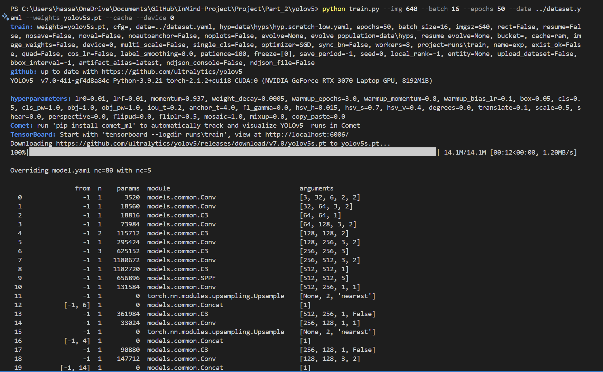
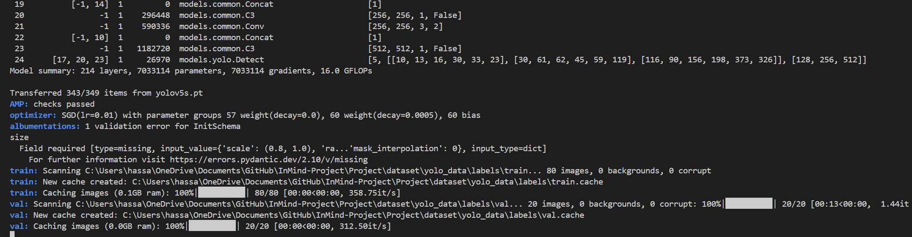
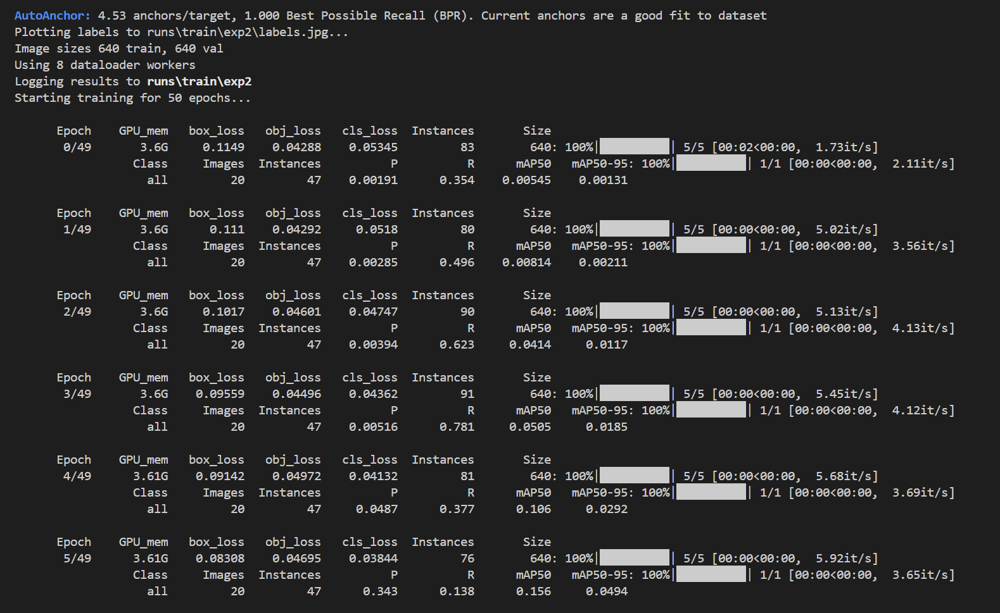
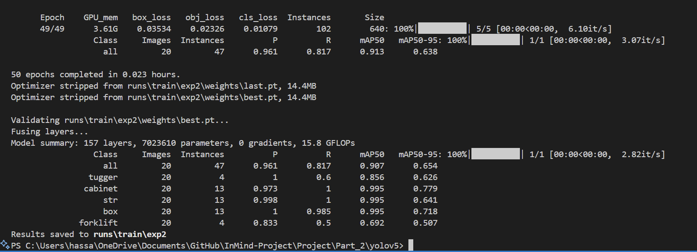

# InMind-Project
 Final ML project for InMind Academy

Documentation steps that i will organize later:

steps for Part 2: -1 (Train an object detection model based on YOLOv5):

git clone https://github.com/ultralytics/yolov5
cd yolov5

then I used "pip install --no-deps -r requirements.txt" for yolov5 dependencies installation to not modify my already existing version because i want to use cuda.

Step 2: Prepare My Dataset

YOLOv5 requires annotations in a specific format. Each image should have a corresponding .txt file with annotations, where each line represents an object in the image in the format:

php-template
Copy
<class_id> <x_center> <y_center> <width> <height>

so i need to make sure that my images and annotation files are organized in the following structure:
/dataset
    /images
        /train
            image1.jpg
            image2.jpg
            ...
        /val
            val_image1.jpg
            val_image2.jpg
            ...
    /labels
        /train
            image1.txt
            image2.txt
            ...
        /val
            val_image1.txt
            val_image2.txt
            ...

then:
Step 3: Create a Custom Data YAML File

Create a .yaml file to define my dataset. This file specifies the paths to my training and validation data and the class names. For example, dataset.yaml:

path: ../../dataset/yolo_data # added here another "../" because training is done inside the "yolov5" repo folder
train: images/train
val: images/val

# Classes
nc: 5
names: 
  0: tugger
  1: cabinet
  2: str
  3: box
  4: forklift

and finally:
Step 4: Train the Model
Now, you're ready to train the model. To start the training process, use the following command in my terminal:

python train.py --img 640 --batch 16 --epochs 50 --data /path/to/dataset.yaml --weights yolov5s.pt --cache
for example if you are training going to train following the steps of this readme, the command is:
python train.py --img 640 --batch 16 --epochs 50 --data ../../dataset/yolo_data/dataset.yaml --weights yolov5s.pt --cache --device 0

Explanation of parameters:

--img 640: Image size (you can adjust this depending on my dataset).

--batch 16: Batch size (you can adjust based on available GPU memory).

--epochs 50: Number of epochs (adjust based on how long you want to train).

--data /path/to/dataset.yaml: Path to my dataset YAML file.

--weights yolov5s.pt: The pre-trained weights file (you can use yolov5s.pt or yolov5m.pt, etc. depending on the size of the model you prefer).

--cache: Cache images for faster training.

--device: specifies to use the gpu.

training images:

*Caption: This image contains the command i used to train and the output in the terminal of the training initiation*

*Caption: This image contains the model informaation that is printed to the user when training a yolo model, for this case im using yolov5s (small)*

*Caption: This image shows the epochs of the training process, total images is 100, divided as 80 for training and 20 for validation*

*Caption: This image shows the completion ouput when the training is done.*

