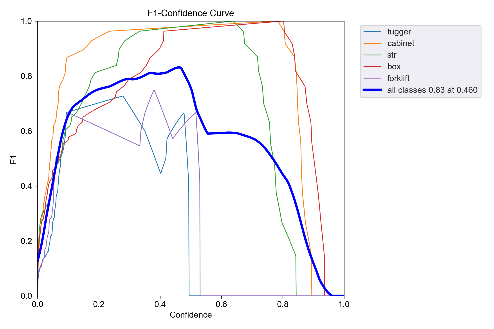

# InMind Project: Industrial Object Detection

This repository contains the implementation of an object detection system for industrial environments using YOLOv5. The project focuses on detecting objects such as tuggers, cabinets, STRs, boxes, and forklifts.

## Table of Contents
- [Project Overview](#project-overview)
- [Part 1: Data Preparation & Visualization](#part-1-data-preparation--visualization)
- [Part 2: Model Training & Evaluation](#part-2-model-training--evaluation)
- [Requirements](#requirements)
- [Results](#results)

## Project Overview

This project implements an object detection system for industrial environments. We train and evaluate YOLOv5 models with different hyperparameters to identify the best configuration for detecting industrial objects.

## Part 1: Data Preparation & Visualization

### 1. Loading the Dataset

We used PyTorch DataLoader to load our dataset and labels for efficient batch processing. The implementation can be found in `Project/Part_1/load_dataset.py`.

### 2. Visualization of Labeled Images

A function was developed to visualize the dataset with bounding box annotations to verify the correctness of our labels. This is implemented in `Project/Part_1/visualize.py`.

### 3. Dataset Augmentation

We explored dataset augmentation using Albumentations library to improve model robustness. The augmentation includes horizontal flips, rotations, and contrast adjustments. Implementation is in `Project/Part_1/augment_dataset.py`.


*Augmented image with preserved bounding boxes*


*Another example of augmentation applied to our dataset*

### 4. Dataset Splitting

The dataset was split into training and validation sets with an 80/20 ratio to ensure proper model evaluation. The implementation is available in `Project/Part_1/split_dataset.py`.

## Part 2: Model Training & Evaluation

### 1. YOLOv5 Model Training

We used YOLOv5 for object detection. First, we cloned the YOLOv5 repository and installed its dependencies:

```bash
git clone https://github.com/ultralytics/yolov5
cd yolov5
pip install --no-deps -r requirements.txt
```

#### Dataset Preparation

YOLOv5 requires annotations in a specific format. Each image has a corresponding .txt file with annotations in the format:
```
<class_id> <x_center> <y_center> <width> <height>
```

Our dataset was organized in the following structure:
```
/dataset
    /images
        /train
            image1.jpg
            image2.jpg
            ...
        /val
            val_image1.jpg
            val_image2.jpg
            ...
    /labels
        /train
            image1.txt
            image2.txt
            ...
        /val
            val_image1.txt
            val_image2.txt
            ...
```

A custom YAML file (`Project/Part_2/dataset.yaml`) was created to define our dataset:

```yaml
path: ../../dataset/yolo_data
train: images/train
val: images/val

# Classes
nc: 5
names: 
  0: tugger
  1: cabinet
  2: str
  3: box
  4: forklift
```

#### Training Process

We trained the model using the following command:

```bash
python train.py --img 640 --batch 16 --epochs 50 --data ../../dataset/yolo_data/dataset.yaml --weights yolov5s.pt --cache --device 0
```

Parameters explanation:
- `--img 640`: Image size (640x640 pixels)
- `--batch 16`: Batch size for training
- `--epochs 50`: Number of training epochs
- `--data`: Path to the dataset YAML file
- `--weights yolov5s.pt`: Pre-trained weights (YOLOv5 small model)
- `--cache`: Cache images for faster training
- `--device 0`: Use GPU for training


*Training command execution and initial output*


*Model architecture summary for YOLOv5s*


*Training progress across epochs (dataset: 80 training images, 20 validation images)*


*Training completion output with final metrics*

### 2. Model Evaluation and Hyperparameter Tuning

After training the initial model, we evaluated its performance on the test dataset using:

```bash
python val.py --weights runs/train/exp/weights/best.pt --data ../../dataset/yolo_data/dataset.yaml --img 640
```


*Evaluation results of the trained model on test dataset*

We then retrained the model with different hyperparameters to improve performance:

```bash
python train.py --img 640 --batch 16 --epochs 50 --data ../../dataset/yolo_data/dataset.yaml --weights yolov5s.pt --cache --device 0 --hyp data/hyps/hyp.scratch-high.yaml
```

The `hyp.scratch-high.yaml` file contains hyperparameters with higher augmentation settings to potentially improve model generalization.


*Training with modified hyperparameters*


*Completion output of hyperparameter-tuned training*

### 3. TensorBoard Visualization

To compare the performance of both models, we saved the training logs and used TensorBoard for visualization:

```bash
# For the standard model
python train.py --img 640 --batch 16 --epochs 50 --data ../../dataset/yolo_data/dataset.yaml --weights yolov5s.pt --cache --device 0 --project runs/train --name normal_train

# For the model with tuned hyperparameters
python train.py --img 640 --batch 16 --epochs 50 --data ../../dataset/yolo_data/dataset.yaml --weights yolov5s.pt --cache --device 0 --hyp data/hyps/hyp.scratch-high.yaml --project runs/train --name hyper_train
```

To visualize the metrics:

```bash
tensorboard --logdir=runs/train
```

This starts a local server at http://localhost:6006/ where you can view training metrics in real-time.

### 4. Model Performance Comparison

We compared both models using various metrics:

#### F1 Score Curves


*F1 score curve for the standard model*


*F1 score curve for the hyperparameter-tuned model*

#### Mean Average Precision (mAP)


*Comparison of mAP@0.5 and mAP@0.5:0.95 between both models*

#### Loss Comparison


*Box loss, class loss, and object loss during training for both models*


*Validation losses for both models*

#### Learning Rate


*Learning rate schedules for both models*

#### Confusion Matrices


*Confusion matrix for the standard model*


*Confusion matrix for the hyperparameter-tuned model*

## Requirements

The project dependencies are specified in `Project/requirements.txt`. The main dependencies include:
- torch==2.1.2+cu118
- torchvision==0.16.2+cu118
- matplotlib
- albumentations
- numpy
- tensorboard

## Results

The hyperparameter-tuned model showed imbalanced little to no improved performance over the standard model, particularly in terms of mAP and F1 score. This is due to our small dataset size and because it is not balanced.
